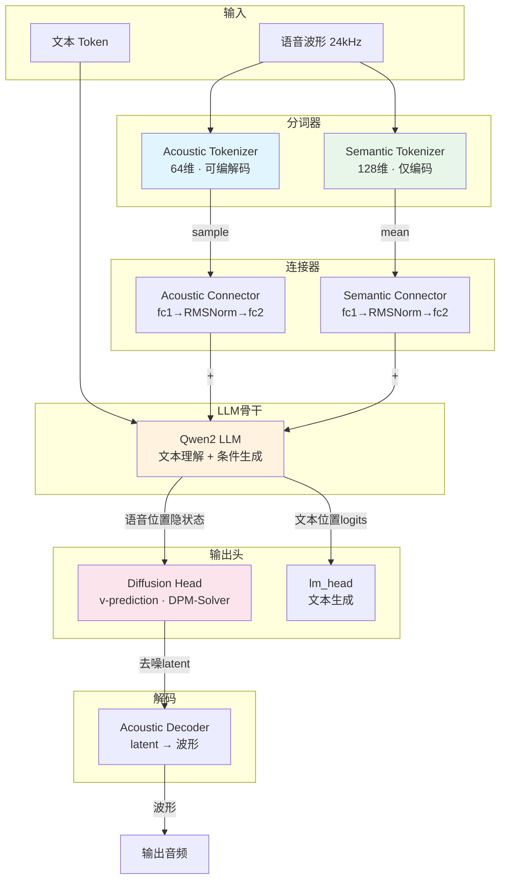
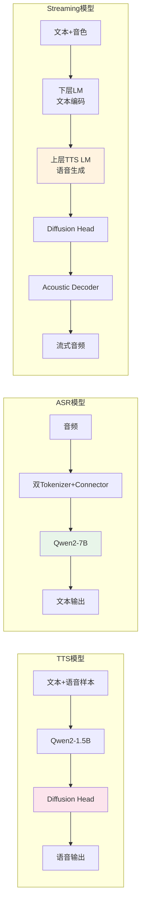
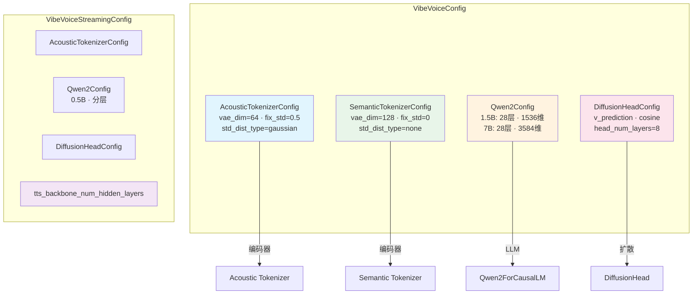
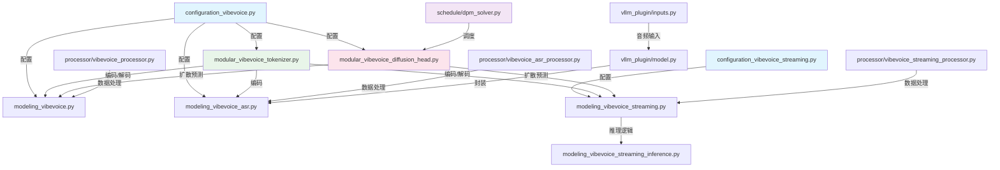

# 第一章：配置系统与模型架构设计

> 本章深入分析 VibeVoice 的配置系统设计和整体模型架构理念，包括组合配置模式、三大模型变体的架构差异、以及关键的工程实现细节。

---

## 1.1 统一语音-文本建模架构

### 1.1.0 整体架构图



### 1.1.1 三大模型变体架构对比图



VibeVoice 的核心设计理念是**将语音视为一种可与文本交替的"语言"**，通过统一的 Transformer 架构同时处理文本和语音：

```
文本 Token ──→ Embedding ──→ ┐
                              ├──→ Qwen2 LLM ──→ 文本生成 / 语音条件
语音 Token ──→ Connector ──→ ┘
```

**关键设计决策**：

1. **双分词器设计**：Acoustic Tokenizer（64维，可编解码）+ Semantic Tokenizer（128维，仅编码），分别捕获声学细节和语义信息
2. **SpeechConnector**：`fc1 → RMSNorm → fc2`（无激活函数），将语音特征投影到 LLM 隐空间
3. **分词器帧率**：7.5 Hz（压缩比 3200:1），即每秒音频仅产生 7.5 个 token
4. **复用 Qwen2-VL 视觉 Token**：避免修改词表，使用 `<|vision_start|>` / `<|object_ref_start|>` 等视觉 token 表示语音

### 1.1.1 为什么选择双分词器？

- **Acoustic Tokenizer**（64维）：负责声学细节的编解码，是唯一具有解码器的分词器，用于将 latent 还原为音频波形
- **Semantic Tokenizer**（128维）：仅编码，提供高层语义信息，帮助 LLM 更好地理解语音内容
- 两者互补：Acoustic 提供重建所需的细节，Semantic 提供理解所需的语义

### 1.1.2 为什么 SpeechConnector 无激活函数？

```python
class SpeechConnector(nn.Module):
    def __init__(self, input_dim, output_dim):
        self.fc1 = nn.Linear(input_dim, output_dim)
        self.norm = RMSNorm(output_dim)
        self.fc2 = nn.Linear(output_dim, output_dim)

    def forward(self, x):
        return self.fc2(self.norm(self.fc1(x)))
```

设计理念是让语音特征**尽可能无损地**投影到 LLM 隐空间。激活函数（如 ReLU、GELU）会引入非线性截断，可能导致信息丢失。纯线性变换 + 归一化保持了语音特征的完整表达能力。

---

## 1.2 三大模型变体的架构差异

| 特性 | VibeVoice-TTS (1.5B) | VibeVoice-ASR (7B) | VibeVoice-Streaming (0.5B) |
|------|----------------------|---------------------|---------------------------|
| LLM 骨干 | Qwen2-1.5B | Qwen2-7B | Qwen2-0.5B（分层） |
| 分词器 | Acoustic + Semantic | Acoustic + Semantic | 仅 Acoustic |
| 扩散头 | ✓ | ✗ | ✓ |
| 生成方向 | 文本→语音 | 语音→文本 | 文本→语音（流式） |
| LLM 分层 | 单一 | 单一 | 下层文本编码 + 上层 TTS 生成 |
| EOS 检测 | 无 | 标准 EOS | BinaryClassifier |
| 配置类 | VibeVoiceConfig | VibeVoiceConfig | VibeVoiceStreamingConfig |
| model_type | vibevoice | vibevoice | vibevoice_streaming |
| 训练损失 | CE + Diffusion | CE only | CE + Diffusion |

### 1.2.1 TTS 变体

- 使用完整的 Qwen2-1.5B 作为 LLM 骨干
- 包含双分词器 + 扩散头
- 训练时同时优化 CE Loss（文本生成）和 Diffusion Loss（语音生成）
- 推理时 LLM 自回归生成文本 token，遇到语音位置时通过扩散头生成语音 latent

### 1.2.2 ASR 变体

- 使用更大的 Qwen2-7B 以获得更强的文本生成能力
- **无扩散头**：ASR 只需要从语音生成文本，不需要语音生成能力
- 训练时仅优化 CE Loss
- 支持超长音频（60分钟+）的流式分段编码

### 1.2.3 Streaming TTS 变体

- 使用较小的 Qwen2-0.5B 以满足实时性要求
- **LLM 分层**：下层编码文本，上层生成语音
- **仅 Acoustic Tokenizer**：流式场景下不需要 Semantic 信息
- **BinaryClassifier EOS 检测**：替代标准 EOS token
- **窗口机制**：5 个文本 token + 6 个语音 token 交替生成

---

## 1.3 配置系统详解

### 1.3.0 配置组合层次图



### 1.3.1 VibeVoiceConfig（`configuration_vibevoice.py`）

**设计模式**：组合配置（Composition Config），`is_composition = True`

```
VibeVoiceConfig
├── acoustic_tokenizer_config: VibeVoiceAcousticTokenizerConfig
├── semantic_tokenizer_config: VibeVoiceSemanticTokenizerConfig
├── decoder_config: Qwen2Config
└── diffusion_head_config: VibeVoiceDiffusionHeadConfig
```

**VibeVoiceAcousticTokenizerConfig 关键参数**：

| 参数 | 默认值 | 说明 |
|------|--------|------|
| vae_dim | 64 | 隐空间维度 |
| fix_std | 0.5 | 固定采样标准差 |
| std_dist_type | "gaussian" | 采样分布类型（fix/gaussian/none） |
| encoder_ratios | [8,5,5,4,2,2] | 下采样比率（乘积=3200） |
| encoder_depths | "3-3-3-3-3-3-8" | 每阶段 Block 数 |
| mixer_layer | "depthwise_conv" | 混合层类型 |
| layer_scale_init_value | 1e-6 | Layer Scale 初始值 |
| norm_type | "conv_rms_norm" | 归一化类型 |
| sample_rate | 24000 | 采样率 |
| codebook_size | -1 | 码本大小（-1表示连续） |
| encoder_kernel_sizes | "7-16-10-10-8-4-4" | 编码器卷积核大小 |
| encoder_dilations | "1-1-1-1-1-1-1" | 编码器膨胀率 |
| decoder_ratios | [2,2,4,5,5,8] | 解码器上采样比率 |
| decoder_depths | "8-3-3-3-3-3-3" | 解码器每阶段 Block 数 |
| decoder_kernel_sizes | "7-4-4-8-10-10-16" | 解码器卷积核大小 |

**VibeVoiceSemanticTokenizerConfig 关键参数**：

| 参数 | 默认值 | 说明 |
|------|--------|------|
| vae_dim | 128 | 隐空间维度（比 Acoustic 更高） |
| fix_std | 0 | 不使用固定标准差 |
| std_dist_type | "none" | 不采样，直接返回 mean |
| 其余参数 | 同 Acoustic | 共享编码器结构 |

**VibeVoiceDiffusionHeadConfig 关键参数**：

| 参数 | 默认值 | 说明 |
|------|--------|------|
| prediction_type | "v_prediction" | v-prediction 模式 |
| ddpm_beta_schedule | "cosine" | 余弦噪声调度 |
| ddpm_num_steps | 1000 | 训练扩散步数 |
| ddpm_num_inference_steps | 20 | 推理扩散步数 |
| head_num_layers | 8 | HeadLayer 层数 |
| head_embed_dim | 512 | 隐层维度 |
| head_cond_dim | 1536 | 条件维度 |
| ddpm_clip_sample | False | 是否裁剪采样值 |

**VibeVoiceConfig 自身参数**：

| 参数 | 默认值 | 说明 |
|------|--------|------|
| acoustic_vae_dim | 64 | Acoustic 隐空间维度 |
| semantic_vae_dim | 128 | Semantic 隐空间维度 |
| speech_scaling_factor | 1.0 | 语音缩放因子（运行时计算） |
| speech_bias_factor | 0.0 | 语音偏移因子（运行时计算） |
| use_speech_scaling | False | 是否使用语音缩放 |
| use_speech_bias | False | 是否使用语音偏移 |

### 1.3.2 VibeVoiceStreamingConfig（`configuration_vibevoice_streaming.py`）

与 VibeVoiceConfig 的关键差异：
- **无 semantic_tokenizer_config**：Streaming 模型仅使用 Acoustic Tokenizer
- **新增 tts_backbone_num_hidden_layers**：指定上层 TTS 生成 Transformer 层数
- **sub_configs 仅包含**：acoustic_tokenizer_config、decoder_config、diffusion_head_config

```python
class VibeVoiceStreamingConfig(PretrainedConfig):
    model_type = "vibevoice_streaming"
    is_composition = True
    sub_configs = {
        "acoustic_tokenizer_config": VibeVoiceAcousticTokenizerConfig,
        "decoder_config": Qwen2Config,
        "diffusion_head_config": VibeVoiceDiffusionHeadConfig,
    }
```

**LLM 分层设计**：
- `decoder_config.num_hidden_layers` = 总层数
- `tts_backbone_num_hidden_layers` = 上层 TTS 层数
- 下层文本编码层数 = 总层数 - tts_backbone_num_hidden_layers

### 1.3.3 模型配置文件对比

**1.5B 模型（`qwen2.5_1.5b_64k.json`）**：
- decoder: Qwen2-1.5B, 28层, hidden_size=1536, 64K 上下文
- Acoustic Tokenizer: vae_dim=64, fix_std=0.5, std_dist_type="gaussian"
- Semantic Tokenizer: vae_dim=128, fix_std=0, std_dist_type="none"
- Diffusion Head: head_num_layers=8, head_embed_dim=512, head_cond_dim=1536

**7B 模型（`qwen2.5_7b_32k.json`）**：
- decoder: Qwen2-7B, 28层, hidden_size=3584, 32K 上下文
- Acoustic Tokenizer: vae_dim=64, fix_std=0.5, std_dist_type="gaussian"
- Semantic Tokenizer: vae_dim=128, fix_std=0, std_dist_type="none"
- Diffusion Head: head_num_layers=8, head_embed_dim=512, head_cond_dim=3584

**关键差异**：两个模型的分词器配置完全相同，差异仅在 LLM 骨干（层数、隐层维度、上下文长度）和扩散头的条件维度。

---

## 1.4 配置的工程细节

### 1.4.1 torch.dtype 序列化修复

```python
def to_dict(self):
    output = super().to_dict()
    return _convert_dtype_to_string(output)
```

修复 GitHub Issue #199：`torch.dtype` 对象无法被 JSON 序列化，`to_dict()` 方法将所有 dtype 对象转为字符串表示。

### 1.4.2 transformers >= 4.57 兼容

```python
def get_text_config(self, decoder=False):
    """Returns the decoder config (required for transformers >= 4.57 cache compatibility)."""
    return self.decoder_config

@property
def num_hidden_layers(self):
    """Proxy to decoder_config.num_hidden_layers (required for transformers >= 4.57)."""
    return self.decoder_config.num_hidden_layers
```

新版 transformers 的缓存机制需要通过 `get_text_config()` 和 `num_hidden_layers` 属性获取模型配置信息。

### 1.4.3 组合配置的初始化逻辑

```python
if acoustic_tokenizer_config is None:
    self.acoustic_tokenizer_config = self.sub_configs["acoustic_tokenizer_config"]()
elif isinstance(acoustic_tokenizer_config, dict):
    acoustic_tokenizer_config["model_type"] = "vibevoice_acoustic_tokenizer"
    self.acoustic_tokenizer_config = self.sub_configs["acoustic_tokenizer_config"](**acoustic_tokenizer_config)
elif isinstance(acoustic_tokenizer_config, VibeVoiceAcousticTokenizerConfig):
    self.acoustic_tokenizer_config = acoustic_tokenizer_config
```

支持三种初始化方式：默认值、字典、配置实例。`model_type` 在字典模式下被强制设置，确保 AutoConfig 能正确识别。

---

## 1.5 语音特征归一化

### 1.5.0 归一化流程图

```mermaid
flowchart LR
    A[Acoustic Tokens<br/>原始分布] --> B{首次遇到?}
    B --> |是| C[计算 mean 和 std]
    C --> D[all_reduce 同步<br/>多GPU平均]
    D --> E[保存 scaling_factor<br/>和 bias_factor]
    B --> |否| F[使用已保存的因子]
    E --> G[归一化<br/>x = (x + bias) × scale]
    F --> G
    G --> H[N(0,1) 分布<br/>利于扩散头训练]

    style A fill:#e1f5fe
    style G fill:#e8f5e9
    style H fill:#fff3e0
```

### 1.5.1 缩放因子计算

```python
# 首次遇到语音数据时计算
if self.use_speech_scaling and self.speech_scaling_factor == 1.0:
    self.speech_scaling_factor = 1 / acoustic_tokens.std().item()
if self.use_speech_bias and self.speech_bias_factor == 0.0:
    self.speech_bias_factor = -acoustic_tokens.mean().item()
```

- `scaling_factor = 1 / std(audio_tokens)` — 归一化方差到 1
- `bias_factor = -mean(audio_tokens)` — 归一化均值到 0
- 归一化后语音特征分布为 N(0, 1)，有助于扩散头的训练稳定性

### 1.5.2 分布式同步

```python
if torch.distributed.is_initialized():
    torch.distributed.all_reduce(scaling_factor, op=torch.distributed.ReduceOp.AVG)
    torch.distributed.all_reduce(bias_factor, op=torch.distributed.ReduceOp.AVG)
```

在多 GPU 训练时，缩放因子通过 `all_reduce` 取平均值，确保所有 GPU 使用相同的归一化参数。

### 1.5.3 应用归一化

```python
audio_features = (acoustic_tokens + self.speech_bias_factor) * self.speech_scaling_factor
```

---

## 1.6 特殊 Token 映射

VibeVoice 复用 Qwen2-VL 的视觉 token 作为语音 token，避免修改词表：

| 用途 | TTS Token | ASR Token |
|------|-----------|-----------|
| 语音开始 | `<|vision_start|>` | `<|object_ref_start|>` |
| 语音结束 | `<|vision_end|>` | `<|object_ref_end|>` |
| 语音填充 | `<|vision_pad|>` | `<|box_start|>` |
| 填充 | `<|image_pad|>` | `<|image_pad|>` |

**语音 token 序列结构**：
```
TTS: <|vision_start|> <|vision_pad|> × N <|vision_end|>
ASR: <|object_ref_start|> <|box_start|> × N <|object_ref_end|>
```
其中 N = 音频时长 × 7.5（帧率）

---

## 1.7 Transformers 版本兼容

代码中大量处理了 transformers >= 4.57 的兼容性问题：

### 1.7.1 MockCacheLayer

```python
class MockCacheLayer:
    """为新版 DynamicCache 提供 layers 接口"""
    def __init__(self):
        self.self_attn = None
        self.cross_attn = None
        self.is_updated = {}
```

新版 DynamicCache 引入了 `layers` 属性，旧版没有。MockCacheLayer 提供兼容接口。

### 1.7.2 _ensure_cache_has_layers

```python
def _ensure_cache_has_layers(cache, num_layers):
    """确保缓存对象具有所需属性"""
    if not hasattr(cache, 'layers'):
        cache.layers = [MockCacheLayer() for _ in range(num_layers)]
```

### 1.7.3 _init_cache_for_generation

```python
def _init_cache_for_generation(model, batch_size, dtype, ...):
    """根据 transformers 版本选择缓存初始化方式"""
    if hasattr(model, '_get_cache'):
        return model._get_cache('dynamic', batch_size, ...)
    else:
        return DynamicCache()
```

---

## 1.8 模块间依赖关系

### 1.8.0 模块依赖图



配置系统是整个项目的基石，所有模型变体都通过组合配置来定义其子模块结构。理解配置系统是理解整个 VibeVoice 架构的关键入口。
