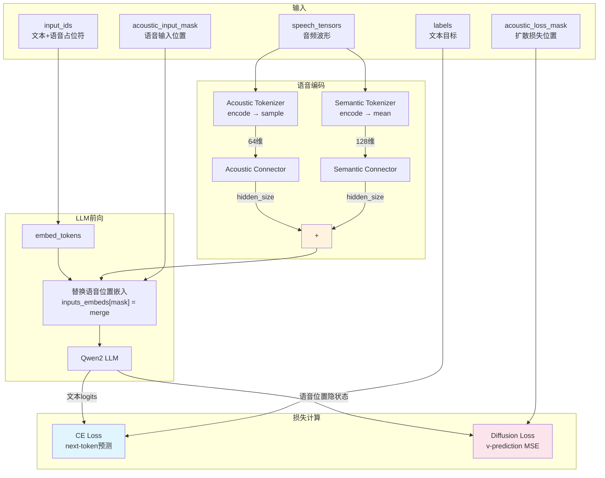
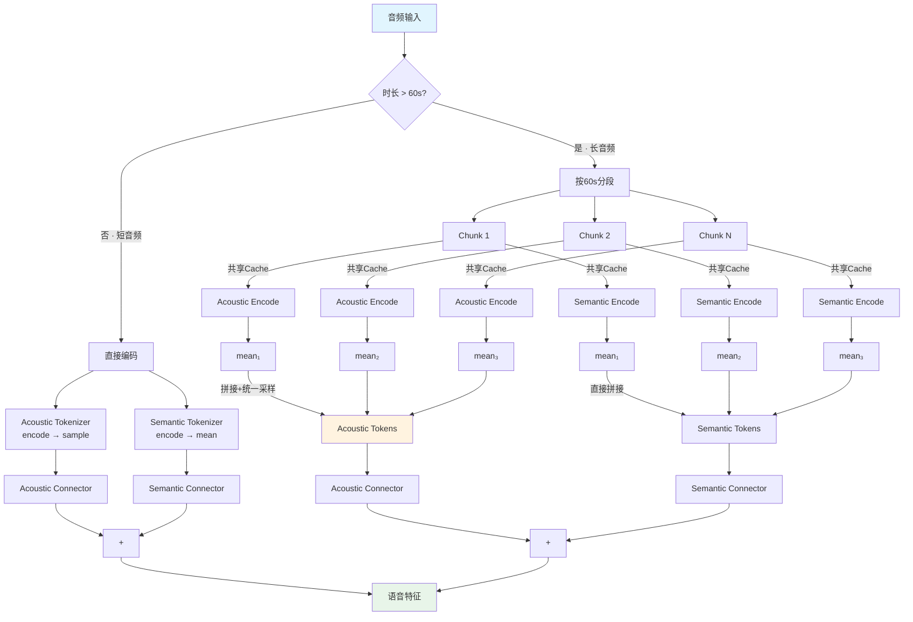

# 第四章：TTS 与 ASR 模型分析

> 本章深入分析 VibeVoice 的 TTS 模型（`modeling_vibevoice.py`）和 ASR 模型（`modeling_vibevoice_asr.py`），包括模型初始化、训练前向传播、语音编码流程、生成机制以及长音频处理策略。

---

## 4.1 TTS 模型（VibeVoiceForConditionalGeneration）

### 4.1.1 模型初始化

```python
class VibeVoiceForConditionalGeneration(VibeVoicePreTrainedModel):
    def __init__(self, config):
        # 子模型
        self.acoustic_tokenizer = VibeVoiceAcousticTokenizerModel(config.acoustic_tokenizer_config)
        self.semantic_tokenizer = VibeVoiceAcousticTokenizerModel(config.semantic_tokenizer_config)
        self.language_model = Qwen2ForCausalLM(config.decoder_config)
        self.prediction_head = VibeVoiceDiffusionHead(config.diffusion_head_config)

        # 连接器
        self.acoustic_connector = SpeechConnector(
            config.acoustic_tokenizer_config.vae_dim,     # 64 → hidden_size
            config.decoder_config.hidden_size
        )
        self.semantic_connector = SpeechConnector(
            config.semantic_tokenizer_config.vae_dim,      # 128 → hidden_size
            config.decoder_config.hidden_size
        )

        # 噪声调度器
        self.noise_scheduler = DPMShellSolverMultistepScheduler(...)

        # 语音缩放因子（运行时计算）
        self.speech_scaling_factor = config.speech_scaling_factor
        self.speech_bias_factor = config.speech_bias_factor
        self.use_speech_scaling = config.use_speech_scaling
        self.use_speech_bias = config.use_speech_bias
```

### 4.1.2 子模型参数量估算

以 1.5B 模型为例：

| 子模型 | 参数量 | 占比 |
|--------|--------|------|
| Qwen2-1.5B (language_model) | ~1.5B | ~95% |
| Acoustic Tokenizer | ~50M | ~3% |
| Semantic Tokenizer | ~20M | ~1.3% |
| Diffusion Head | ~5M | ~0.3% |
| Connectors | ~0.5M | ~0.03% |

LLM 骨干占据了绝大部分参数，分词器和扩散头相对轻量。

---

## 4.2 TTS 训练前向传播

### 4.2.0 TTS 训练数据流图



### 4.2.1 完整流程

```python
def forward(self, input_ids, speech_tensors, acoustic_input_mask, acoustic_loss_mask, labels, ...):
    # 1. 文本嵌入
    inputs_embeds = self.language_model.model.embed_tokens(input_ids)

    # 2. 语音特征编码
    acoustic_encoder_outputs = self.acoustic_tokenizer.encode(speech_tensors)
    acoustic_tokens = acoustic_encoder_outputs.sample()  # (B, vae_dim, T')
    acoustic_tokens = acoustic_tokens.transpose(1, 2)    # (B, T', vae_dim)

    semantic_encoder_outputs = self.semantic_tokenizer.encode(speech_tensors)
    semantic_tokens = semantic_encoder_outputs.mean      # (B, T', vae_dim_sem)
    semantic_tokens = semantic_tokens.transpose(1, 2)

    # 3. 语音特征缩放
    if self.use_speech_scaling:
        acoustic_tokens = (acoustic_tokens + self.speech_bias_factor) * self.speech_scaling_factor

    # 4. 连接器投影
    acoustic_features = self.acoustic_connector(acoustic_tokens)    # (B, T', hidden_size)
    semantic_features = self.semantic_connector(semantic_tokens)     # (B, T', hidden_size)

    # 5. 替换语音位置嵌入
    inputs_embeds[acoustic_input_mask] = acoustic_features + semantic_features

    # 6. LLM 前向传播
    outputs = self.language_model(inputs_embeds=inputs_embeds, output_hidden_states=True, ...)

    # 7. CE 损失（文本部分）
    logits = outputs.logits
    ce_loss = CrossEntropyLoss(shifted_logits, shifted_labels)

    # 8. 扩散损失（语音部分）
    condition = outputs.hidden_states[acoustic_loss_mask]
    timesteps = torch.randint(0, self.noise_scheduler.config.num_train_timesteps, (B,))
    noise = torch.randn_like(acoustic_tokens)
    noisy_speech = self.noise_scheduler.add_noise(acoustic_tokens, noise, timesteps)
    model_pred = self.prediction_head(noisy_speech, timesteps, condition)
    v_target = self.noise_scheduler.get_v(acoustic_tokens, noise, timesteps)
    diffusion_loss = F.mse_loss(model_pred, v_target)

    return CausalLMOutput(loss=ce_loss, diffusion_loss=diffusion_loss)
```

### 4.2.2 损失函数详解

**CE Loss（文本部分）**：
- 标准 next-token 预测损失
- 只在文本 token 位置计算
- 驱动 LLM 学习文本生成和上下文理解

**Diffusion Loss（语音部分）**：
- MSE 损失，比较预测的 v 值和目标 v 值
- 只在语音 token 位置计算
- 驱动扩散头学习从 LLM 条件生成语音 latent

**总损失**：
```python
total_loss = ce_loss + diffusion_loss_weight * diffusion_loss
```

### 4.2.3 acoustic_input_mask 与 acoustic_loss_mask 的区别

- `acoustic_input_mask`：标记输入中语音 token 的位置（用于替换嵌入）
- `acoustic_loss_mask`：标记输出中需要计算扩散损失的位置

两者的区别在于，输入的语音 token 包含了语音输入（如 voice prompt）和语音输出（生成的语音），但只有语音输出位置需要计算扩散损失。

---

## 4.3 语音特征缩放

### 4.3.1 缩放因子计算

```python
# 首次遇到语音数据时计算
if self.use_speech_scaling and self.speech_scaling_factor == 1.0:
    self.speech_scaling_factor = 1 / acoustic_tokens.std().item()
if self.use_speech_bias and self.speech_bias_factor == 0.0:
    self.speech_bias_factor = -acoustic_tokens.mean().item()
```

- `scaling_factor = 1 / std(audio_tokens)` — 归一化方差到 1
- `bias_factor = -mean(audio_tokens)` — 归一化均值到 0
- 归一化后语音特征分布为 N(0, 1)，有助于扩散头的训练稳定性

### 4.3.2 分布式同步

```python
if torch.distributed.is_initialized():
    torch.distributed.all_reduce(scaling_factor, op=torch.distributed.ReduceOp.AVG)
    torch.distributed.all_reduce(bias_factor, op=torch.distributed.ReduceOp.AVG)
```

在多 GPU 训练时，缩放因子通过 `all_reduce` 取平均值，确保所有 GPU 使用相同的归一化参数。

### 4.3.3 应用归一化

```python
audio_features = (acoustic_tokens + self.speech_bias_factor) * self.speech_scaling_factor
```

---

## 4.4 TTS 生成流程

TTS 生成使用 transformers 的 `generate()` 方法，通过 `prepare_inputs_for_generation` 钩子实现自回归生成。

### 4.4.1 prepare_inputs_for_generation

```python
def prepare_inputs_for_generation(self, input_ids, past_key_values=None, ...):
    if past_key_values is None:
        # 第一次调用：编码语音，构建完整输入
        inputs_embeds = self.language_model.model.embed_tokens(input_ids)
        if speech_tensors is not None:
            speech_features = self.encode_speech(speech_tensors)
            inputs_embeds[acoustic_input_mask] = speech_features
        return {"inputs_embeds": inputs_embeds, "use_cache": True}
    else:
        # 后续调用：利用 KV Cache，只传入最新 token
        input_ids = input_ids[:, -1:]
        return {"input_ids": input_ids, "past_key_values": past_key_values, ...}
```

### 4.4.2 生成过程

```
输入: [system_prompt] [voice_prompt] [text_input] [speech_start]

Step 1: LLM 处理完整输入，KV Cache 缓存所有 token 的 KV
Step 2: LLM 生成下一个 token（利用 KV Cache）
  → 如果是文本 token：继续自回归生成
  → 如果是语音位置：LLM 输出条件特征 → 扩散头生成语音 latent → 解码为音频
Step 3: 重复 Step 2 直到遇到 EOS
```

---

## 4.5 ASR 模型（VibeVoiceASRForConditionalGeneration）

### 4.5.1 模型初始化

```python
class VibeVoiceASRForConditionalGeneration(VibeVoicePreTrainedModel):
    def __init__(self, config):
        self.acoustic_tokenizer = VibeVoiceAcousticTokenizerModel(config.acoustic_tokenizer_config)
        self.semantic_tokenizer = VibeVoiceAcousticTokenizerModel(config.semantic_tokenizer_config)
        self.language_model = Qwen2ForCausalLM(config.decoder_config)
        self.lm_head = nn.Linear(config.decoder_config.hidden_size, config.decoder_config.vocab_size, bias=False)

        self.acoustic_connector = SpeechConnector(...)
        self.semantic_connector = SpeechConnector(...)
```

**与 TTS 模型的关键差异**：
- **无扩散头**：ASR 只需要文本生成，不需要语音生成
- **独立的 lm_head**：ASR 模型使用自己的 `lm_head`，而非 `language_model.lm_head`
- **更大的 LLM**：7B vs 1.5B，更强的文本生成能力

---

## 4.6 ASR 语音编码

### 4.6.0 ASR 长音频编码流程图



### 4.6.1 encode_speech 方法

```python
def encode_speech(self, speech_tensors, ...):
    # 短音频（<=60s）：直接编码
    if audio_length <= max_chunk_length:
        acoustic_tokens = self.acoustic_tokenizer.encode(audio).sample()
        semantic_tokens = self.semantic_tokenizer.encode(audio).mean
    # 长音频（>60s）：流式分段编码
    else:
        cache = VibeVoiceTokenizerStreamingCache()
        acoustic_means, semantic_means = [], []
        for chunk in chunks:
            acoustic_out = self.acoustic_tokenizer.encode(chunk, cache=cache)
            acoustic_means.append(acoustic_out.mean)
            semantic_out = self.semantic_tokenizer.encode(chunk, cache=cache)
            semantic_means.append(semantic_out.mean)
        # 拼接所有段的 mean 后统一采样
        acoustic_tokens = sample(cat(acoustic_means))
        semantic_tokens = cat(semantic_means)  # Semantic 直接用 mean

    # 连接器投影
    acoustic_features = self.acoustic_connector(acoustic_tokens)
    semantic_features = self.semantic_connector(semantic_tokens)
    return acoustic_features + semantic_features
```

### 4.6.2 长音频处理的关键设计

1. **分段编码**：按 60s 分段，使用共享缓存保证跨段边界的连续性
2. **Acoustic Tokenizer**：先收集各段 mean，拼接后统一采样
   - 为什么统一采样？因为采样引入随机性，如果各段独立采样，拼接后的语音在段边界处可能不连续
   - 统一采样保证全局一致性
3. **Semantic Tokenizer**：直接使用各段 mean
   - Semantic 不需要解码，无需采样
   - mean 是确定性的，各段独立计算不影响一致性
4. **避免卷积溢出**：当序列长度 > 2^32 时 int32 索引会溢出

---

## 4.7 ASR 训练前向传播

```python
def forward(self, input_ids, speech_tensors, acoustic_input_mask, labels, ...):
    # 1. 文本嵌入
    inputs_embeds = self.language_model.model.embed_tokens(input_ids)

    # 2. 语音编码
    speech_features = self.encode_speech(speech_tensors)

    # 3. 替换语音位置嵌入
    inputs_embeds[acoustic_input_mask] = speech_features

    # 4. LLM 前向传播
    outputs = self.language_model(inputs_embeds=inputs_embeds)

    # 5. 计算损失
    logits = self.lm_head(outputs[0])
    loss = CrossEntropyLoss(logits, labels)

    return CausalLMOutput(loss=loss)
```

**与 TTS 的对比**：
- ASR 只有 CE Loss，没有 Diffusion Loss
- ASR 使用独立的 `lm_head`，而非 `language_model.lm_head`
- ASR 的 `acoustic_input_mask` 使用 `<|box_start|>` token 位置

---

## 4.8 ASR 生成流程

### 4.8.1 prepare_inputs_for_generation

```python
def prepare_inputs_for_generation(self, input_ids, past_key_values=None, ...):
    if past_key_values is None:
        # 第一次前向传播：编码语音并注入
        speech_features = self.encode_speech(speech_tensors)
        inputs_embeds = self.language_model.model.embed_tokens(input_ids)
        inputs_embeds[acoustic_input_mask] = speech_features
        return {"inputs_embeds": inputs_embeds, "use_cache": True}
    else:
        # 后续前向传播：利用 KV Cache，只传入最新 token
        input_ids = input_ids[:, -1:]
        return {"input_ids": input_ids, "past_key_values": past_key_values, ...}
```

遵循 Qwen2-VL 模式：语音输入仅在第一次前向传播时传入，后续利用 KV Cache。

### 4.8.2 生成过程

```
输入: [system_prompt] [audio_tokens] [duration_info] [transcription_request]

Step 1: 编码语音，替换 audio token 位置的嵌入
Step 2: LLM 处理完整输入，KV Cache 缓存
Step 3: LLM 自回归生成转写文本
  → 每步只传入最新 token，利用 KV Cache 加速
Step 4: 遇到 EOS 或达到 max_new_tokens 时停止
```

---

## 4.9 TTS 与 ASR 的架构对比

| 方面 | TTS | ASR |
|------|-----|-----|
| 输入 | 文本 + 语音样本 | 音频 |
| 输出 | 语音 | 文本 |
| LLM 大小 | 1.5B | 7B |
| 扩散头 | ✓ | ✗ |
| 训练损失 | CE + Diffusion | CE only |
| 语音 token | `<\|vision_pad\|>` | `<\|box_start\|>` |
| 语音编码 | Acoustic.sample + Semantic.mean | Acoustic.sample + Semantic.mean |
| 长音频 | 不适用 | 流式分段编码 |
| 生成方式 | 自回归 + 扩散采样 | 纯自回归 |

---

## 4.10 数据流图

### 4.10.0 TTS vs ASR 架构对比图

```mermaid
graph TB
    subgraph TTS训练
        T_SCRIPT[播客脚本] --> T_PROC[VibeVoiceProcessor]
        T_AUDIO[语音样本] --> T_AT[Acoustic Tokenizer]
        T_AUDIO --> T_ST[Semantic Tokenizer]
        T_AT --> T_AC[Acoustic Connector]
        T_ST --> T_SC[Semantic Connector]
        T_AC --> T_MERGE["+ "]
        T_SC --> T_MERGE
        T_PROC --> T_LLM[Qwen2-1.5B]
        T_MERGE --> T_LLM
        T_LLM --> T_CE[CE Loss]
        T_LLM --> T_DH[Diffusion Head]
        T_DH --> T_DL[Diffusion Loss]
    end

    subgraph ASR推理
        A_FILE[音频文件] --> A_NORM[ffmpeg + 归一化]
        A_NORM --> A_AT[Acoustic Tokenizer]
        A_NORM --> A_ST[Semantic Tokenizer]
        A_AT --> A_AC[Acoustic Connector]
        A_ST --> A_SC[Semantic Connector]
        A_AC --> A_MERGE["+ "]
        A_SC --> A_MERGE
        A_MERGE --> A_LLM[Qwen2-7B]
        A_LLM --> A_HEAD[lm_head]
        A_HEAD --> A_TEXT[转写文本]
    end

    style T_CE fill:#e1f5fe
    style T_DL fill:#fce4ec
    style A_TEXT fill:#e8f5e9
```



### 4.10.1 TTS 训练数据流

```
播客脚本 + 语音样本
  → VibeVoiceProcessor: 解析脚本，构建 token 序列
  → AcousticTokenizer.encode → sample → acoustic_connector
  → SemanticTokenizer.encode → mean → semantic_connector
  → 替换语音位置嵌入
  → Qwen2 LLM 前向传播
  → CE Loss (文本) + Diffusion Loss (语音)
```

### 4.10.2 ASR 推理数据流

```
音频文件
  → ffmpeg 加载 → 24kHz 重采样 → dB归一化
  → VibeVoiceASRProcessor: 构建 input_ids + acoustic_input_mask
  → AcousticTokenizer.encode → sample → acoustic_connector
  → SemanticTokenizer.encode → mean → semantic_connector
  → 合并嵌入替换 acoustic_input_mask 位置
  → Qwen2 LLM 自回归生成
  → lm_head → token IDs → 解码为文本
```

---

## 4.11 总结

TTS 和 ASR 模型共享核心的分词器和 LLM 架构，但在上层任务头和训练目标上有显著差异：

1. **TTS**：LLM + 扩散头，双损失训练，从文本生成语音
2. **ASR**：纯 LLM，单损失训练，从语音生成文本
3. **共享设计**：双分词器 + 连接器 + 嵌入替换机制
4. **长音频支持**：ASR 特有的流式分段编码，支持 60 分钟+ 音频
5. **KV Cache 优化**：语音输入仅编码一次，后续生成利用缓存
