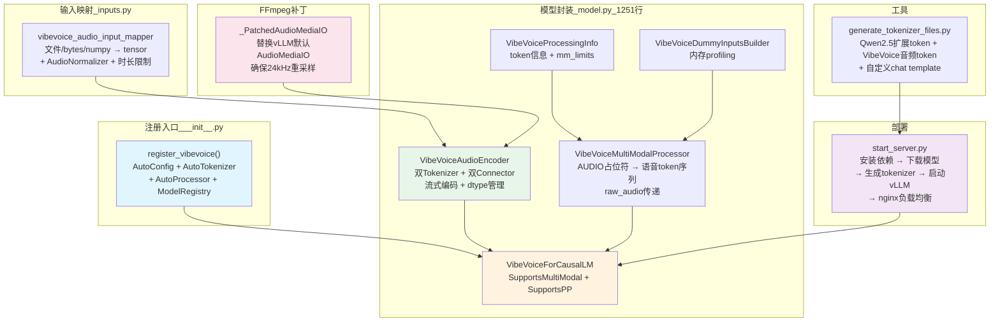
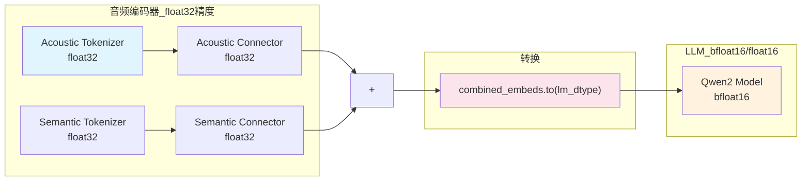
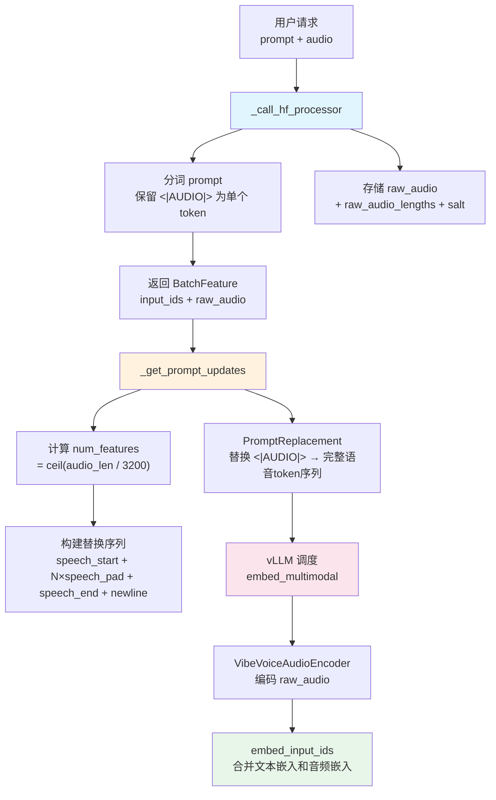
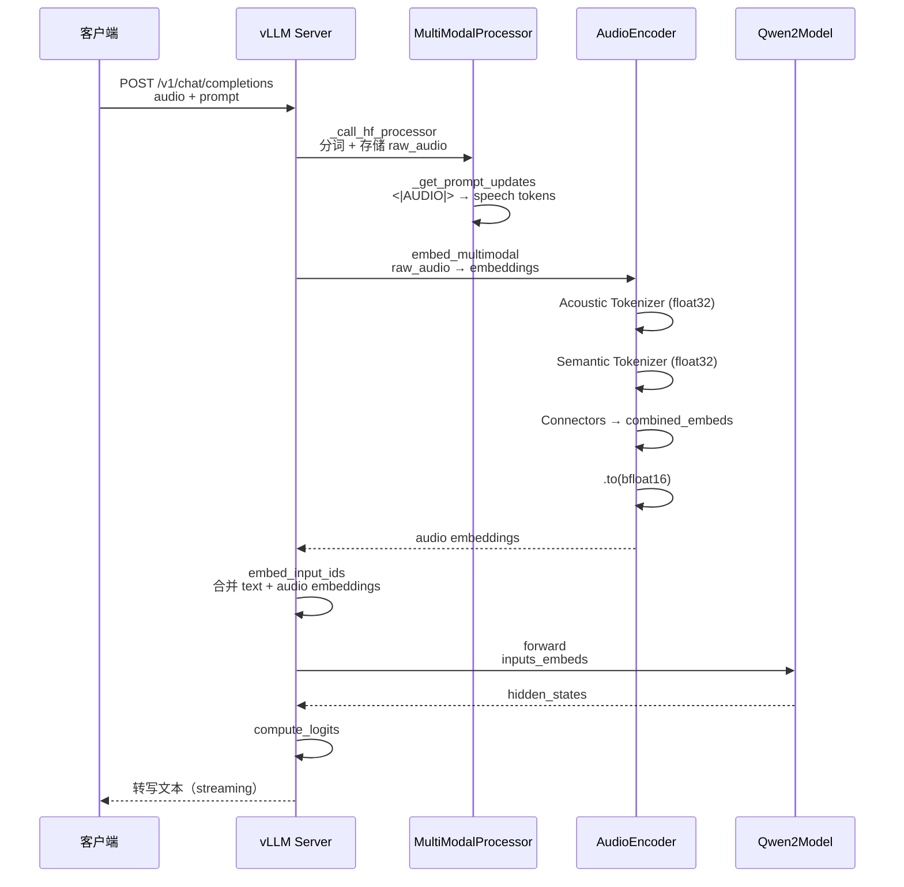
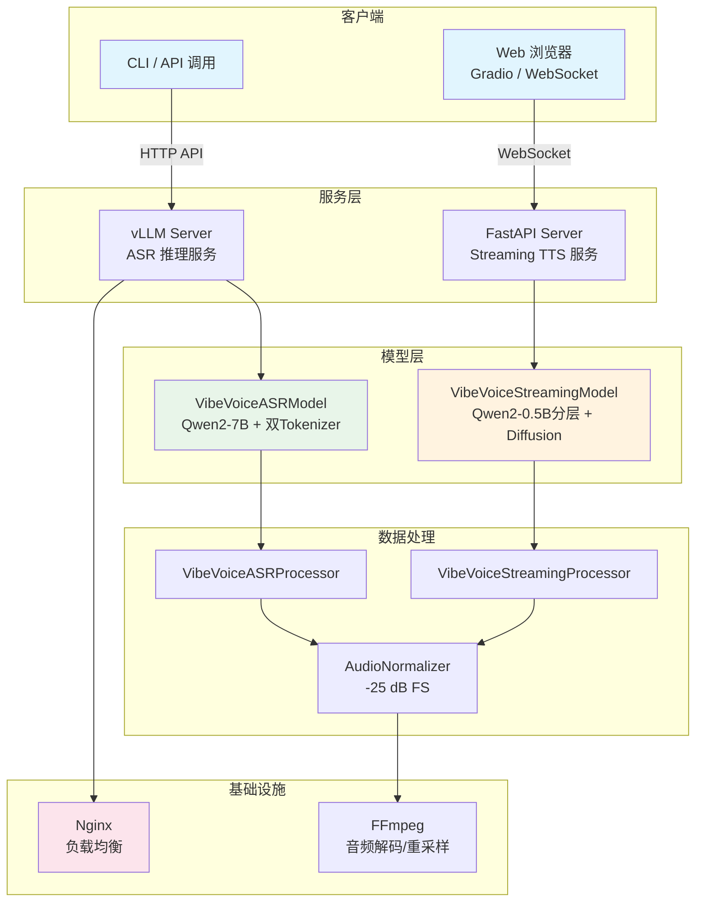

# 第六章：处理器、vLLM 插件与部署分析

> 本章深入分析 VibeVoice 的数据处理器（processor/）、vLLM 推理加速插件、演示脚本和微调流程，覆盖从数据处理到模型部署的完整工程链路。

---

## 6.1 数据处理器总览

### 6.1.0 三种处理器对比图

```mermaid
graph TB
    subgraph VibeVoiceProcessor_TTS
        T_SCRIPT[播客脚本<br/>Speaker X: text] --> T_PARSE[脚本解析]
        T_PARSE --> T_TOKEN["构建 token 序列<br/>system + voice + text + speech"]
        T_TOKEN --> T_INSERT["插入特殊 token<br/>vision_start + N×vision_pad + vision_end"]
        T_INSERT --> T_OUT["input_ids + speech_input_mask<br/>+ speech_tensors"]
    end

    subgraph VibeVoiceASRProcessor_ASR
        A_AUDIO[音频文件] --> A_LOAD["ffmpeg加载<br/>24kHz重采样"]
        A_LOAD --> A_NORM[dB归一化]
        A_NORM --> A_CHAT["构建聊天模板<br/>object_ref_start + N×box_start + object_ref_end"]
        A_CHAT --> A_OUT["input_ids + acoustic_input_mask<br/>+ speech_tensors"]
    end

    subgraph VibeVoiceStreamingProcessor_Streaming
        S_TEXT[文本] --> S_VOICE[Voice Prompt]
        S_VOICE --> S_CACHE["process_input_with_cached_prompt<br/>支持KV Cache复用"]
        S_CACHE --> S_OUT["tts_lm_input_ids<br/>+ tts_text_ids"]
    end

    style T_INSERT fill:#e1f5fe
    style A_CHAT fill:#e8f5e9
    style S_CACHE fill:#fff3e0
```



VibeVoice 提供三种处理器，分别对应三种模型变体：

| 处理器 | 模型变体 | 特殊 Token | 输出 |
|--------|---------|-----------|------|
| VibeVoiceProcessor | TTS | `<\|vision_pad\|>` | input_ids + speech_input_mask + speech_tensors |
| VibeVoiceASRProcessor | ASR | `<\|box_start\|>` | input_ids + acoustic_input_mask + speech_tensors |
| VibeVoiceStreamingProcessor | Streaming TTS | 自定义 | tts_lm_input_ids + tts_text_ids |

---

## 6.2 VibeVoiceProcessor（TTS）

### 6.2.1 处理播客脚本的完整流程

1. **脚本解析**：`Speaker X: text` 格式
2. **构建 token 序列**：system prompt + voice input + text input + speech output
3. **语音位置标记**：在语音位置插入特殊 token
4. **语音样本处理**：加载 → 归一化 → 填充

### 6.2.2 特殊 Token 映射

| 用途 | TTS Token | ASR Token |
|------|-----------|-----------|
| 语音开始 | `<|vision_start|>` | `<|object_ref_start|>` |
| 语音结束 | `<|vision_end|>` | `<|object_ref_end|>` |
| 语音填充 | `<|vision_pad|>` | `<|box_start|>` |
| 填充 | `<|image_pad|>` | `<|image_pad|>` |

**语音 token 序列结构**：
```
<|vision_start|> <|vision_pad|> × N <|vision_end|>
```
其中 N = 音频时长 × 7.5（帧率）

### 6.2.3 语音样本处理

```python
def process_speech(self, speech_samples):
    # 加载音频文件
    audios = [load_audio(path) for path in speech_samples]
    # 归一化
    audios = [AudioNormalizer()(audio) for audio in audios]
    # 填充到相同长度
    max_len = max(len(a) for a in audios)
    audios = [np.pad(a, (0, max_len - len(a))) for a in audios]
    return torch.tensor(audios)
```

---

## 6.3 VibeVoiceASRProcessor（ASR）

### 6.3.1 处理 ASR 输入的流程

1. **音频加载**：支持 ffmpeg 和 soundfile
2. **重采样**：到 24kHz
3. **dB FS 归一化**：使用 AudioNormalizer
4. **构建聊天模板**
5. **创建 `acoustic_input_mask`**
6. **热词支持**

### 6.3.2 聊天模板格式

```
<|im_start|>system
You are a speech recognition assistant.<|im_end|>
<|im_start|>user
<|object_ref_start|><|box_start|> × N <|object_ref_end|>
The audio lasts for {duration:.1f} seconds.
Please transcribe the audio into text.
Context info: {context_info}<|im_end|>
<|im_start|>assistant
```

### 6.3.3 音频时长计算

```python
num_speech_tokens = int(audio_duration * 7.5)  # 7.5 Hz 帧率
```

### 6.3.4 热词支持

```python
def __call__(self, audio, context_info=None, ...):
    if context_info:
        prompt += f"\nContext info: {context_info}"
```

热词通过 `context_info` 参数传入，添加到 user message 中。这允许用户指定领域专有名词、人名等，提高转写准确率。

---

## 6.4 VibeVoiceStreamingProcessor（流式 TTS）

### 6.4.1 特殊之处

- `__call__` 故意未实现（`raise NotImplementedError`）
- 必须使用 `process_input_with_cached_prompt` 方法
- 接受预计算的 KV Cache（`cached_prompt`），避免重复编码 voice prompt
- 输出包含 `tts_lm_input_ids` 和 `tts_text_ids` 两套 token 序列

### 6.4.2 process_input_with_cached_prompt 方法

```python
def process_input_with_cached_prompt(self, text, voice_prompt, cached_prompt=None, ...):
    # 构建 voice prompt token 序列
    voice_ids = tokenize(voice_prompt)
    # 构建 TTS 文本 token 序列
    tts_text_ids = tokenize(text)
    # 构建 TTS LM 输入 ID（包含 voice prompt + 文本）
    tts_lm_input_ids = cat([voice_ids, text_start_ids])

    return VibeVoiceStreamingProcessorOutput(
        tts_lm_input_ids=tts_lm_input_ids,
        tts_text_ids=tts_text_ids,
        ...
    )
```

### 6.4.3 为什么需要两套 token 序列？

- `tts_lm_input_ids`：用于下层 LLM 的输入，包含 voice prompt + 文本
- `tts_text_ids`：仅包含需要生成语音的文本 token，按 TTS_TEXT_WINDOW_SIZE=5 分窗口

---

## 6.5 VibeVoiceTokenizerProcessor

分词器的统一封装，处理文本分词和特殊 token 的添加/移除。

---

## 6.6 AudioNormalizer

```python
class AudioNormalizer:
    def __init__(self, target_dBFS=-25):
        self.target_dBFS = target_dBFS

    def __call__(self, audio):
        audio = tailor_dB_FS(audio, self.target_dBFS)
        audio = avoid_clipping(audio)
        return audio
```

- `tailor_dB_FS`：调整音频到目标 dB FS（默认 -25）
- `avoid_clipping`：防止削波失真

**为什么需要归一化？**
- 不同来源的音频响度差异很大
- 统一响度有助于模型学习稳定的语音特征
- -25 dB FS 是语音处理的常用目标响度

---

## 6.7 vLLM 插件

### 6.7.0 vLLM 插件架构图



### 6.7.1 注册入口（`__init__.py`）

#### 完整注册流程

```python
def register_vibevoice():
    # 1. 注册配置类
    AutoConfig.register("vibevoice", VibeVoiceConfig)

    # 2. 注册分词器（关键：影响 ASR 质量）
    # VibeVoiceASRTextTokenizerFast 映射：
    #   speech_start_id -> <|object_ref_start|>
    #   speech_pad_id   -> <|box_start|>
    #   speech_end_id   -> <|object_ref_end|>
    AutoTokenizer.register(
        VibeVoiceConfig,
        slow_tokenizer_class=Qwen2Tokenizer,
        fast_tokenizer_class=VibeVoiceASRTextTokenizerFast,
    )

    # 3. 注册处理器（兼容 vLLM 多模态管线）
    AutoProcessor.register(VibeVoiceConfig, processor_class=Qwen2AudioProcessor)

    # 4. 注册模型架构（必须与 config.json 中 "architectures" 匹配）
    ModelRegistry.register_model("VibeVoice", VibeVoiceForCausalLM)
    ModelRegistry.register_model("VibeVoiceForASRTraining", VibeVoiceForCausalLM)
```

**自动加载机制**：

通过 `pyproject.toml` 的入口点，vLLM 启动时自动调用 `register_vibevoice()`：
```toml
[project.entry-points."vllm.general_plugins"]
vibevoice = "vllm_plugin:register_vibevoice"
```

**注册顺序的重要性**：
1. `AutoConfig` 必须先注册，因为后续注册需要配置类
2. `AutoTokenizer` 注册时需要 `VibeVoiceConfig` 作为 key
3. `ModelRegistry` 注册的架构名必须与模型 `config.json` 中的 `architectures` 字段完全匹配
4. 注册了两个架构名（`VibeVoice` 和 `VibeVoiceForASRTraining`），后者兼容训练检查点

### 6.7.2 FFmpeg 补丁（`model.py` 头部）

#### 为什么需要补丁？

vLLM 默认使用 `soundfile` 库加载音频，存在两个问题：
1. 不支持 MP3、AAC 等常见格式
2. 默认重采样到 16kHz（Whisper 的采样率），而 VibeVoice 需要 24kHz

#### 补丁实现

```python
class _PatchedAudioMediaIO(_OriginalAudioMediaIO):
    """替换 vLLM 默认的 AudioMediaIO，使用 FFmpeg 解码"""

    def load_bytes(self, data: bytes) -> tuple[np.ndarray, int]:
        return _ffmpeg_load_bytes(data)  # FFmpeg 解码 + 24kHz 重采样

    def load_base64(self, media_type: str, data: str) -> tuple[np.ndarray, int]:
        return _ffmpeg_load_bytes(base64.b64decode(data))

    def load_file(self, filepath) -> tuple[np.ndarray, int]:
        return _ffmpeg_load_file(filepath)  # FFmpeg 解码 + 24kHz 重采样
```

#### 全局替换策略

```python
# 替换 vLLM 中的 AudioMediaIO（兼容新旧版本）
try:
    import vllm.multimodal.media.audio as _vllm_audio_module
    _vllm_audio_module.AudioMediaIO = _PatchedAudioMediaIO
except ImportError:
    import vllm.multimodal.audio as _vllm_audio_module
    _vllm_audio_module.AudioMediaIO = _PatchedAudioMediaIO

# 同时替换 utils 模块中的引用
try:
    import vllm.multimodal.utils as _vllm_utils_module
    _vllm_utils_module.AudioMediaIO = _PatchedAudioMediaIO
except (ImportError, AttributeError):
    pass
```

补丁在模块加载时立即执行，确保 vLLM 的所有音频加载路径都使用 FFmpeg。

### 6.7.3 VibeVoiceAudioEncoder（`model.py`）

#### 初始化详解

```python
class VibeVoiceAudioEncoder(nn.Module):
    def __init__(self, config):
        # 1. 解析配置（兼容 dict 和对象两种格式）
        self.acoustic_vae_dim = get_cfg(config, "acoustic_vae_dim", 64)
        self.semantic_vae_dim = get_cfg(config, "semantic_vae_dim", 128)

        # 2. 获取 LLM hidden_size（兼容多种配置格式）
        # 尝试顺序：decoder_config → text_config → config 本身 → 默认 3584
        target_hidden_size = None
        if decoder_config is not None:
            target_hidden_size = get_cfg(decoder_config, "hidden_size")
        if target_hidden_size is None and text_config is not None:
            target_hidden_size = get_cfg(text_config, "hidden_size")
        if target_hidden_size is None:
            target_hidden_size = get_cfg(config, "hidden_size", 3584)

        # 3. 创建分词器（float32 精度）
        self.acoustic_tokenizer = VibeVoiceAcousticTokenizerModel(acoustic_config)
        self.semantic_tokenizer = VibeVoiceSemanticTokenizerModel(semantic_config)

        # 4. 创建连接器
        self.acoustic_connector = SpeechConnector(self.acoustic_vae_dim, self.hidden_size)
        self.semantic_connector = SpeechConnector(self.semantic_vae_dim, self.hidden_size)

        # 5. 流式编码配置
        self.enable_streaming = get_cfg(config, "enable_streaming", True)
        self.streaming_segment_duration = get_cfg(config, "streaming_segment_duration", 60.0)

        # 6. 采样模式控制（环境变量）
        # VIBEVOICE_USE_MEAN=1 时使用确定性 mean，否则使用 sample
        use_mean_env = os.getenv("VIBEVOICE_USE_MEAN", "").strip().lower()
        self.use_sample = use_mean_env not in ("1", "true", "yes")

        # 7. dtype 管理
        self._audio_encoder_dtype = ...  # 从 config 读取，默认 float32
        self._lm_dtype = torch.bfloat16  # LLM 使用的 dtype
```

#### dtype 管理策略



**为什么分词器需要 float32？**
- 音频编码涉及大量卷积运算，float16/bfloat16 可能导致数值溢出或精度损失
- `_ensure_audio_encoder_dtype()` 方法在每次前向传播前检查并恢复 float32
- vLLM 加载权重时可能将所有参数转为 bfloat16，需要显式恢复

#### 前向传播详解

```python
def forward(self, audio, *, use_streaming=True, segment_duration_s=None, use_sample=None):
    # 1. 确保 dtype 正确
    self._ensure_audio_encoder_dtype()
    audio = audio.to(dtype=self._audio_encoder_dtype)

    # 2. 判断是否需要流式编码
    use_streaming = use_streaming and self.enable_streaming and total_samples > segment_samples

    with torch.no_grad():
        if not use_streaming:
            # 短音频：直接编码
            acoustic_out = self.acoustic_tokenizer.encode(audio.unsqueeze(1))
            acoustic_tokens = acoustic_out.sample() if use_sample else acoustic_out.mean
            acoustic_embeds = self.acoustic_connector(acoustic_tokens)

            semantic_out = self.semantic_tokenizer.encode(audio.unsqueeze(1))
            semantic_tokens = semantic_out.mean  # Semantic 始终用 mean
            semantic_embeds = self.semantic_connector(semantic_tokens)
        else:
            # 长音频：流式分段编码
            acoustic_cache = VibeVoiceTokenizerStreamingCache()
            semantic_cache = VibeVoiceTokenizerStreamingCache()
            acoustic_mean_segments = []
            semantic_mean_segments = []

            for seg_idx, (start, end) in enumerate(segments):
                chunk = audio[:, start:end].contiguous()
                is_final = (seg_idx == num_segments - 1)

                # 分段编码（共享缓存）
                acoustic_enc_out = self.acoustic_tokenizer.encode(
                    chunk.unsqueeze(1), cache=acoustic_cache,
                    sample_indices=sample_indices, use_cache=True,
                    is_final_chunk=is_final,
                )
                acoustic_mean_segments.append(acoustic_enc_out.mean)

                semantic_enc_out = self.semantic_tokenizer.encode(
                    chunk.unsqueeze(1), cache=semantic_cache,
                    sample_indices=sample_indices, use_cache=True,
                    is_final_chunk=is_final,
                )
                semantic_mean_segments.append(semantic_enc_out.mean)

            # 拼接所有段后统一采样
            acoustic_mean_full = torch.cat(acoustic_mean_segments, dim=1)
            acoustic_enc_full = VibeVoiceTokenizerEncoderOutput(
                mean=acoustic_mean_full, std=self.acoustic_tokenizer.fix_std,
            )
            acoustic_tokens = acoustic_enc_full.sample() if use_sample else acoustic_enc_full.mean
            acoustic_embeds = self.acoustic_connector(acoustic_tokens)

            semantic_tokens = torch.cat(semantic_mean_segments, dim=1)
            semantic_embeds = self.semantic_connector(semantic_tokens)

    # 3. 合并嵌入并转换 dtype
    combined_embeds = acoustic_embeds + semantic_embeds
    combined_embeds = combined_embeds.to(dtype=self._lm_dtype)
    return combined_embeds
```

### 6.7.4 VibeVoiceMultiModalProcessor（`model.py`）

这是 vLLM 多模态管线中最复杂的组件，负责将音频输入转换为模型可处理的格式。

#### 处理流程图



#### _call_hf_processor 详解

```python
def _call_hf_processor(self, prompt, mm_data, mm_kwargs, tok_kwargs):
    # 关键设计：不在此处展开 <|AUDIO|>，而是保留为单个 token
    # 让 _get_prompt_updates 负责展开

    # 1. 分词（保留 <|AUDIO|> 为单个 token）
    prompt_ids = tokenizer.encode(prompt, add_special_tokens=False)

    # 2. 存储原始音频数据
    max_len = max(len(a) for a in raw_audio_list)
    raw_audio_tensors = []
    audio_lengths = []
    for audio in raw_audio_list:
        audio_len = len(audio)
        audio_lengths.append(audio_len)
        if audio_len < max_len:
            audio = np.pad(audio, (0, max_len - audio_len))
        raw_audio_tensors.append(torch.from_numpy(audio).float())

    result["raw_audio"] = torch.stack(raw_audio_tensors)  # [num_audios, max_len]
    result["raw_audio_lengths"] = torch.tensor(audio_lengths)

    # 3. 添加随机 salt（绕过 vLLM 缓存）
    result["salt"] = torch.tensor([hash(uuid.uuid4()) % 100000])

    return result
```

**为什么需要 salt？** vLLM 会缓存多模态处理结果，相同输入会命中缓存。但音频数据每次都不同，需要 salt 确保每次请求都重新处理。

#### _get_prompt_updates 详解

```python
def _get_prompt_updates(self, mm_items, hf_processor_mm_kwargs, out_mm_kwargs):
    # 1. 查找特殊 token ID
    speech_start_id = vocab.get("<|object_ref_start|>")
    speech_end_id = vocab.get("<|object_ref_end|>")
    speech_pad_id = vocab.get("<|box_start|>")

    # 2. 从 raw_audio_lengths 计算语音 token 数量
    audio_len = raw_audio_lengths[item_idx]
    num_features = max(1, int(np.ceil(audio_len / compress_ratio)))

    # 3. 构建替换 token 序列
    replacement_ids = [
        speech_start_id,                    # <|object_ref_start|>
        *[speech_pad_id] * num_features,    # N × <|box_start|>
        speech_end_id,                      # <|object_ref_end|>
        newline_id,                         # \n (token 198)
    ]

    return [PromptReplacement(modality="audio", target="<|AUDIO|>", replacement=get_replacement)]
```

**newline_id = 198 的作用**：在语音 token 序列末尾添加换行符，确保后续文本从新行开始，与 ASR 处理器的聊天模板格式一致。

### 6.7.5 VibeVoiceForCausalLM（`model.py`）

#### 初始化

```python
@MULTIMODAL_REGISTRY.register_processor(
    VibeVoiceMultiModalProcessor,
    info=VibeVoiceProcessingInfo,
    dummy_inputs=VibeVoiceDummyInputsBuilder,
)
class VibeVoiceForCausalLM(nn.Module, SupportsMultiModal, SupportsPP):

    @classmethod
    def get_placeholder_str(cls, modality, i):
        """vLLM 在对话模板中插入的占位符"""
        if modality.startswith("audio"):
            return "<|AUDIO|>"

    def __init__(self, *, vllm_config, prefix=""):
        config = vllm_config.model_config.hf_config

        # 音频编码器
        self.audio_encoder = VibeVoiceAudioEncoder(config)

        # 语言模型（使用 vLLM 的注册机制初始化 Qwen2）
        self.language_model = init_vllm_registered_model(
            vllm_config=vllm_config,
            hf_config=decoder_config,
            prefix=maybe_prefix(prefix, "language_model"),
            architectures=["Qwen2ForCausalLM"],
        )

        # 设置 dtype
        self.audio_encoder._lm_dtype = vllm_config.model_config.dtype
        self.audio_encoder._ensure_audio_encoder_dtype()
```

#### embed_multimodal：音频嵌入生成

```python
def embed_multimodal(self, **kwargs):
    """vLLM 调用此方法获取音频嵌入"""
    raw_audio = kwargs.get("raw_audio")
    raw_audio_lengths = kwargs.get("raw_audio_lengths")

    embeddings = []
    for i, audio_tensor in enumerate(audio_list):
        # 裁剪到实际长度（去除 padding）
        actual_len = int(raw_audio_lengths[i])
        audio_tensor = audio_tensor[..., :actual_len]

        # 通过音频编码器
        audio_embeds = self.audio_encoder(
            audio_tensor,
            use_streaming=use_streaming_flag,
            segment_duration_s=streaming_segment_duration,
        )
        embeddings.append(audio_embeds.squeeze(0))

    return tuple(embeddings)
```

#### embed_input_ids：嵌入合并

```python
def embed_input_ids(self, input_ids, multimodal_embeddings=None, is_multimodal=None, **kwargs):
    """合并文本嵌入和音频嵌入"""
    # 1. 文本嵌入
    inputs_embeds = self.get_input_embeddings()(input_ids)

    # 2. 合并多模态嵌入
    if multimodal_embeddings is not None and is_multimodal is not None:
        inputs_embeds = _merge_multimodal_embeddings(
            inputs_embeds, multimodal_embeddings, is_multimodal,
        )

    return inputs_embeds
```

`is_multimodal` 是一个布尔掩码，标记哪些位置是语音 token（`<|box_start|>`），这些位置的嵌入会被音频嵌入替换。

#### forward：前向传播

```python
def forward(self, input_ids, positions, intermediate_tensors=None, inputs_embeds=None, **kwargs):
    # 优先使用 inputs_embeds（来自 vLLM 多模态合并）
    if inputs_embeds is None and input_ids is not None:
        inputs_embeds = self.get_input_embeddings()(input_ids)

    if intermediate_tensors is not None:
        inputs_embeds = None  # Pipeline Parallelism

    # 调用 Qwen2Model
    hidden_states = language_model.model(
        input_ids=None,  # 避免双重嵌入
        positions=positions,
        intermediate_tensors=intermediate_tensors,
        inputs_embeds=inputs_embeds,
    )
    return hidden_states
```

#### 权重映射

```python
def load_weights(self, weights):
    mapper = WeightsMapper(
        orig_to_new_prefix={
            # 音频编码器：model.X -> audio_encoder.X
            "model.acoustic_tokenizer.": "audio_encoder.acoustic_tokenizer.",
            "model.semantic_tokenizer.": "audio_encoder.semantic_tokenizer.",
            "model.acoustic_connector.": "audio_encoder.acoustic_connector.",
            "model.semantic_connector.": "audio_encoder.semantic_connector.",
            # 语言模型：model.language_model.X -> language_model.model.X
            "model.language_model.": "language_model.model.",
            # LM head
            "lm_head.": "language_model.lm_head.",
        }
    )
    loader = AutoWeightsLoader(self)
    return loader.load_weights(weights, mapper=mapper)
```

**映射逻辑**：训练时的模型结构与 vLLM 推理时的结构不同。训练时音频编码器在 `model.acoustic_tokenizer`，推理时在 `audio_encoder.acoustic_tokenizer`。

### 6.7.6 VibeVoiceProcessingInfo 与 DummyInputsBuilder

#### VibeVoiceProcessingInfo

```python
class VibeVoiceProcessingInfo(BaseProcessingInfo):
    def get_supported_mm_limits(self):
        return {"audio": 1}  # 每个请求最多1个音频

    def get_mm_max_tokens_per_item(self, seq_len, mm_counts):
        """告诉 vLLM 调度器音频 token 的上限"""
        max_audio_samples = 61 * 60 * 24000  # 61分钟
        max_audio_tokens = int(np.ceil(max_audio_samples / 3200)) + 3
        max_audio_tokens = min(max_audio_tokens, seq_len)  # 不超过上下文窗口
        return {"audio": max_audio_tokens}
```

**为什么是 61 分钟？** 这是模型设计的最大音频长度，对应 `VIBEVOICE_MAX_AUDIO_DURATION=3660` 秒。

#### VibeVoiceDummyInputsBuilder

```python
class VibeVoiceDummyInputsBuilder(BaseDummyInputsBuilder):
    def get_dummy_mm_data(self, seq_len, mm_counts, mm_options=None):
        """生成虚拟音频数据用于内存 profiling"""
        max_audio_len = self._get_max_audio_samples(seq_len)
        return {"audio": self._get_dummy_audios(length=max_audio_len, num_audios=num_audios)}
```

vLLM 使用虚拟输入来：
1. 测量峰值 GPU 激活内存 → 确定 KV Cache 容量
2. 预热 CUDA Graph

### 6.7.7 音频输入映射（`inputs.py`）

```python
def vibevoice_audio_input_mapper(ctx, data) -> MultiModalInputs:
    """将各种格式的音频输入转为 vLLM MultiModalInputs"""

    if isinstance(data, str):
        # 文件路径 → FFmpeg 加载 + 归一化
        audio_waveform = load_audio(data)

    elif isinstance(data, bytes):
        # 字节数据 → FFmpeg stdin pipe 解码（避免临时文件IO）
        audio_waveform, _sr = load_audio_bytes_use_ffmpeg(data, resample=True, target_sr=24000)
        audio_waveform = AudioNormalizer()(audio_waveform)

    elif isinstance(data, np.ndarray):
        # 已加载的 numpy 数组
        audio_waveform = data

    # 时长验证（防止 OOM）
    duration_sec = len(audio_waveform) / 24000
    if duration_sec > _MAX_AUDIO_DURATION:
        raise ValueError(f"Audio duration ({duration_sec:.1f}s) exceeds limit ({_MAX_AUDIO_DURATION:.0f}s)")

    return MultiModalInputs({
        "audio": torch.from_numpy(audio_waveform).float(),
        "audio_length": audio_tensor.shape[0],
    })
```

**时长限制**：默认 3660 秒（61 分钟），可通过 `VIBEVOICE_MAX_AUDIO_DURATION` 环境变量调整。这是为了防止 GPU OOM（GitHub Issue #210）。

### 6.7.8 分词器文件生成工具（`tools/generate_tokenizer_files.py`）

#### Token ID 分配

```python
# Qwen2.5 扩展 token（151646-151664）
QWEN25_EXTENDED_TOKENS = {
    "<|object_ref_start|>": 151646,  # speech_start_id
    "<|object_ref_end|>": 151647,    # speech_end_id
    "<|box_start|>": 151648,         # speech_pad_id
    "<|box_end|>": 151649,
    "<|vision_start|>": 151652,
    "<|vision_end|>": 151653,
    "<|vision_pad|>": 151654,
    "<|image_pad|>": 151655,
    ...
}

# VibeVoice 专用音频 token（接续 Qwen2.5 的最后一个 ID）
VIBEVOICE_AUDIO_TOKENS = {
    "<|AUDIO|>": 151665,       # vLLM 占位符
    "<|audio_bos|>": 151666,   # 音频开始
    "<|audio_eos|>": 151667,   # 音频结束
}
```

#### 自定义 Chat Template

生成工具还修改了 Qwen2 的聊天模板，添加音频支持：

```jinja2
{# 处理音频内容 #}

    {{- '<|AUDIO|>' }}

```

当对话消息中包含 `type: "audio"` 的内容时，自动插入 `<|AUDIO|>` 占位符。

### 6.7.9 一键部署脚本（`scripts/start_server.py`）

#### 部署流程

```mermaid
flowchart TD
    A[开始部署] --> B[安装系统依赖<br/>ffmpeg + libsndfile1]
    B --> C[安装 VibeVoice<br/>pip install -e .[vllm]]
    C --> D[下载模型<br/>huggingface_hub.snapshot_download]
    D --> E[生成分词器文件<br/>generate_tokenizer_files.py]
    E --> F{DP > 1?}
    F --> |否| G[启动单个 vLLM 服务]
    F --> |是| H[启动 N 个 vLLM 进程]
    H --> I[配置 nginx 负载均衡]
    I --> J[服务就绪]

    style A fill:#e1f5fe
    style J fill:#e8f5e9
    style I fill:#fce4ec
```

#### vLLM 启动参数

```python
vllm_cmd = [
    "vllm", "serve", model_path,
    "--served-model-name", "vibevoice",
    "--trust-remote-code",     # 信任远程代码（必须）
    "--dtype", "bfloat16",     # LLM 使用 bfloat16
    "--max-num-seqs", "64",    # 最大并发序列数
    "--max-model-len", "65536", # 最大上下文长度
    "--gpu-memory-utilization", "0.8",  # GPU 内存利用率
]
```

#### 数据并行（DP）策略

当 `DP > 1` 时，启动 N 个独立的 vLLM 进程，每个绑定不同的端口，然后使用 nginx 进行负载均衡：

```nginx
upstream vibevoice {
    server 127.0.0.1:8000;
    server 127.0.0.1:8001;
    server 127.0.0.1:8002;
}
```

**为什么不用 vLLM 内置的 DP？** vLLM 的内置 DP 协调器存在单进程 HTTP 瓶颈，独立进程 + nginx 的吞吐量更高。

### 6.7.10 vLLM 推理完整数据流



---

## 6.8 演示脚本

### 6.8.1 ASR 文件推理（`vibevoice_asr_inference_from_file.py`，581行）

支持批量推理：
- 从 JSONL 数据集加载音频和文本
- 支持单样本和批量处理
- 输出 WER/CER 评估指标
- 支持热词（context_info）

### 6.8.2 ASR Gradio 演示（`vibevoice_asr_gradio_demo.py`，1268行）

功能丰富的 Web 界面：
- 上传/录制音频
- 实时转写
- 音频片段提取
- 流式输出
- 支持 MP3 和 WAV 格式
- 热词输入

### 6.8.3 流式 TTS 文件推理（`realtime_model_inference_from_file.py`，311行）

- 从文本文件读取内容
- 支持说话人音色映射
- 输出音频文件和生成指标（延迟、RTF 等）

### 6.8.4 Web 实时 TTS（`web/app.py`，517行）

FastAPI + WebSocket 实时 TTS 服务：
- `StreamingTTSService` 类封装模型加载和语音生成
- `/stream` WebSocket 端点提供实时音频流
- 支持配置参数：CFG 缩放、推理步骤、语音预设
- 语音缓存机制
- 线程安全的并发请求处理

---

## 6.9 微调（`finetuning-asr/`）

### 6.9.1 LoRA 微调脚本（`lora_finetune.py`，538行）

```python
model = VibeVoiceASRForConditionalGeneration.from_pretrained(base_model)

lora_config = LoraConfig(
    r=8,
    lora_alpha=16,
    target_modules=["q_proj", "v_proj"],  # 只微调注意力层
    lora_dropout=0.05,
    task_type="CAUSAL_LM",
)

model = get_peft_model(model, lora_config)
```

**LoRA 配置说明**：
- `r=8`：LoRA 秩为 8，在参数效率和表达能力之间取得平衡
- `lora_alpha=16`：缩放因子，实际缩放 = alpha/r = 2
- `target_modules=["q_proj", "v_proj"]`：只微调注意力的 Q 和 V 投影
- `lora_dropout=0.05`：5% 的 dropout 防止过拟合

### 6.9.2 LoRA 推理脚本（`inference_lora.py`，234行）

```python
model = VibeVoiceASRForConditionalGeneration.from_pretrained(base_model)
model = PeftModel.from_pretrained(model, lora_path)
model = model.merge_and_unload()  # 合并权重

result = model.generate(...)
```

**merge_and_unload**：将 LoRA 权重合并到基础模型中，推理时无额外开销。

---

## 6.10 vLLM 自动恢复机制

`test_api_auto_recover.py`（638行）实现了模型重复输出的自动恢复：

1. **重复模式检测**：检测连续相同 token 的模式
2. **自动重试**：调整采样参数（temperature、top_p）打破循环
3. **内容保存**：保存已处理的有效内容
4. **上下文恢复**：在重试时恢复已转写的内容

---

## 6.11 文本分词器（`modular_vibevoice_text_tokenizer.py`）

```python
class VibeVoiceASRTextTokenizerFast(PreTrainedTokenizerFast):
    special_tokens = {
        "object_ref_start": "<|object_ref_start|>",
        "object_ref_end": "<|object_ref_end|>",
        "box_start": "<|box_start|>",
    }
```

基于 Qwen2 的快速文本分词器，添加了 ASR 特殊 token。

---

## 6.12 数据流图

### 6.12.0 完整部署架构图



### 6.12.1 vLLM ASR 服务数据流

```
HTTP 请求 (音频文件/bytes)
  → VibeVoiceAudioInputMapper: 加载 → 归一化 → 时长限制
  → VibeVoiceMultiModalProcessor: <|AUDIO|> → 语音 token 序列
  → VibeVoiceAudioEncoder: 双分词器编码 → 连接器投影
  → Qwen2Model: 自回归生成
  → lm_head → token IDs → 解码为文本
  → HTTP 响应 (转写文本)
```

### 6.12.2 Web 实时 TTS 数据流

```
WebSocket 连接
  → 接收文本 + 语音预设
  → VibeVoiceStreamingProcessor: 构建 tts_lm_input_ids + tts_text_ids
  → StreamingTTSService.generate():
      → 文本窗口 → LM → TTS LM → 扩散采样 → 音频解码
      → audio_streamer.put(音频块)
  → WebSocket 发送音频块
  → 客户端播放
```

---

## 6.13 总结

VibeVoice 的工程化设计完善：

1. **三种处理器**：针对 TTS/ASR/Streaming 的差异化数据处理
2. **vLLM 插件**：通过注册机制无缝集成，支持多模态推理服务化
3. **一键部署**：从依赖安装到服务启动的完整自动化
4. **LoRA 微调**：参数高效微调，适配特定领域
5. **多种演示**：Gradio/Web/FastAPI 覆盖不同使用场景
6. **自动恢复**：处理模型重复输出等异常情况
7. **音频归一化**：统一的响度处理确保推理稳定性
